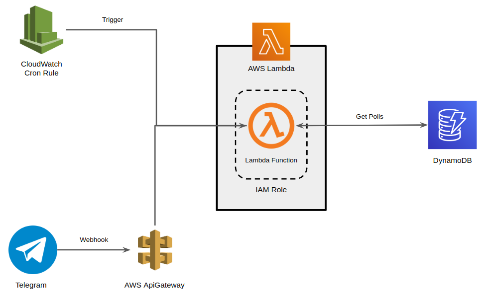
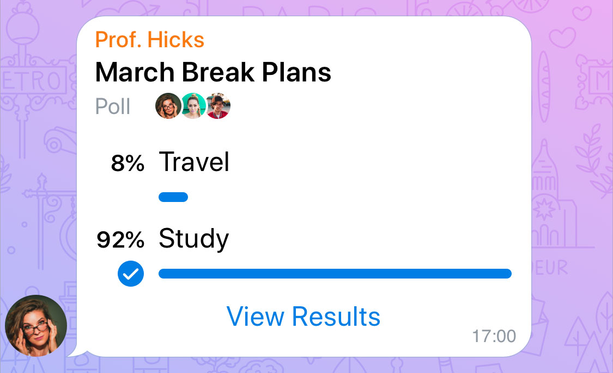

[![Contributors][contributors-shield]][contributors-url]
[![Forks][forks-shield]][forks-url]
[![Stargazers][stars-shield]][stars-url]
[![Issues][issues-shield]][issues-url]
[![MIT License][license-shield]][license-url]
[![LinkedIn][linkedin-shield]][linkedin-url]


<!-- PROJECT LOGO -->
<br />
<p align="center">
  <a href="https://github.com/thecrux4020/telegram-bot">
    
  </a>

  <h3 align="center">Telegram Polls</h3>

  <p align="center">
    Simple bot to send quizzes to telegram channel
    <br />
    <a href="#how-it-works"><strong>Explore how it works »</strong></a>
    <br />
    <br />
    <a href="https://github.com/thecrux4020/telegram-bot/issues">Report Bug</a>
    ·
    <a href="https://github.com/thecrux4020/telegram-bot/issues">Request Feature</a>
  </p>
</p>


<!-- TABLE OF CONTENTS -->
<details open="open">
  <summary>Table of Contents</summary>
  <ol>
    <li>
      <a href="#how-it-works">How It Works</a>
      <ul>
        <li><a href="#polls-job">Polls Job</a></li>
        <li><a href="#infrastructure">Infrastructure</a></li>
        <li><a href="#project-structure">Project Structure</a></li>
      </ul>
    </li>
    <li>
      <a href="#getting-started">Getting Started</a>
      <ul>
        <li><a href="#prerequisites">Prerequisites</a></li>
        <li><a href="#installation">Installation</a></li>
        <li><a href="#deploy-on-aws">Deploy on AWS</a></li>
      </ul>
    </li>
    <li><a href="#roadmap">Roadmap</a></li>
    <li><a href="#contributing">Contributing</a></li>
    <li><a href="#license">License</a></li>
    <li><a href="#contact">Contact</a></li>
    <!-- <li><a href="#acknowledgements">Acknowledgements</a></li> -->
  </ol>
</details>


<!-- HOW IT WORKS -->
## How It Works
<br />
<p align="center">
    
</p>
<!-- [![Product Name Screen Shot][product-screenshot]](https://example.com) -->
The bot supports 2 different operational modes, <em>jobs</em> and <em>webhooks</em>:

* **Jobs** is designed to run specific tasks, like a crontab job in linux, but the example above is a serverless job. 
* **Webhooks** is designed to handle events (messages, audios, images, etc) from telegram. When something happens in the channel, or someone send something to the bot.

___

Different jobs could run in different lambda functions, or in different environments (for example, a docker image on linux). Each job has a configuration section inside `settings.ini`, where you can configure all the variables related to it.

Usually, each job has a storage associated with, in the case of polls-job, the storage is a dynamodb table, where all the polls/quizzes are stored. 

Each job has a cloudwatch event rule, that triggers the job in a specific point in time, for example, every day at 09:00 AM.

___

### Polls Job

Polls are a way that telegram has to send quizzes or questions to a channel. You can send a quizz with multiple answer, or just a quiz with one correct answer. After you answer to the quiz, you can see the statistics of it.

Example: 

<p align="center">
    
</p>

The job has a dynamodb table where job manager (you!) store all the questions that want to send to the channel. With the help of a cloudwatch rule lambda function trigger in a specific time of the day, take one question from the dynamodb table, send it to the channel and update the status of the quiz.

The table has a field calle `has_been_used`; this field is used to avoid send the same question multiple times. The lambda function selects a question randomly, and after send to the channel, mark the question as used.

To know which job will run, you have to configure an environment variable called `JOB_NAME` (for example, JOB_NAME=POLL). In this way, we could create multiple lambda function with the same code for all of functions, but at deploy time we configure the environment variable to specify which job will run inside de lambda function.

___

### Infrastructure

Inside iac/ path, you'll find the **terraform** files needed to deploy the infrastructure inside AWS, but if you want, you can host the bot wherever you like; You just need to adjust the config file and run `main.py`, like other python apps (don't forget installing dependencies and setting environment variables).

___

### Project Structure

- **app**: _source code of the app_
    - **helpers**: _common functions_
    - **jobs**: _all the jobs, each job has one class_
    - **repository**: _classes for interact with storage_
- **iac**: _terraform files_
    - `main.tf`: _configuration stuff_
    - `poll_job.tf`: _poll job infrastructure definition_
    - `provider.tf`: _provider configuration_
    - `variables.tf`: _variables used in code_
- **images**: _images for README.md_
- **scripts**: _usefull scripts_
    - `build.sh`: _generate build file to deploy in lambda (run before deploy in terraform)_
- `settings.ini`: _configuration file_
- `main.py`: _main file of the app, all setup stuff of python app_
- `requirements.txt`: _dependencies file_

___

<!-- GETTING STARTED -->
## Getting Started

Here we go! 

lets see the steps to install and run the project...

___

### Prerequisites

First of all, we need to install python and pip. After that, we could use virtualenv to install all dependencies inside virtualenv.

- Install pip
```sh
sudo apt-get install python3-pip
```
- Install virtualenv
```sh
sudo pip3 install virtualenv 
```

- Create a telegram bot and join to channel
    - <a href="https://core.telegram.org/bots#6-botfather">How to setup telegram bot</a>

___


### Installation

The steps described here are for running the project **locally**, if you want to run it inside AWS, see <a href="#deploy-on-aws">deploy on AWS</a>

1. Clone the repository
```sh
git clone https://github.com/thecrux4020/telegram-bot
```

2. Now create virtualenv in the venv directory
```sh
virtualenv -p python3 venv 
```
3. Activate the virtual environment
```sh
source venv/bin/activate
```

4. Install all dependecies
```sh
pip3 install -r requirements.txt
```

5. Configure environment variables
```sh
export JOB_NAME=POLL && export TELEGRAM_TOKEN=mytoken
```
replace \"*__mytoken__*\" with the token obtained from telegram bot setup

6. Replace channel_id and table_name in `settings.ini` file, with your parameters.

___

### Deploy on AWS

For the AWS deploy, we will use terraform as IaC (Infrastructure As Code) tool to deploy the bot in AWS.

1. <a href="https://learn.hashicorp.com/tutorials/terraform/install-cli">Install terraform </a>
2. Create bucket to save terraform state: <a href="https://docs.aws.amazon.com/AmazonS3/latest/userguide/create-bucket-overview.html">How to create bucket on AWS </a>

3. Grant s3 permission to your actual IAM user:
     ```
        {
            "Version": "2012-10-17",
            "Statement": [
                {
                    "Effect": "Allow",
                    "Action": "s3:ListBucket",
                    "Resource": "arn:aws:s3:::mybucket"
                },
                {
                    "Effect": "Allow",
                    "Action": ["s3:GetObject", "s3:PutObject"],
                    "Resource": "arn:aws:s3:::mybucket/path/to/my/key"
                }
            ]
        }
    ```
4. Initialize terraform
    ```sh
    terraform init
    ```
5. Deploy changes in AWS (your user must have permissions to create resources)
    ```sh
    terraform apply
    ```

<!-- ROADMAP -->
## Roadmap

See the [open issues](https://github.com/thecrux4020/telegram-bot/issues) for a list of proposed features (and known issues).

<!-- CONTRIBUTING -->
## Contributing

Contributions are what make the open source community such an amazing place to be learn, inspire, and create. Any contributions you make are **greatly appreciated**.

1. Fork the Project
2. Create your Feature Branch (`git checkout -b feature/AmazingFeature`)
3. Commit your Changes (`git commit -m 'Add some AmazingFeature'`)
4. Push to the Branch (`git push origin feature/AmazingFeature`)
5. Open a Pull Request

<!-- LICENSE -->
## License

Distributed under the MIT License. See `LICENSE` for more information.

<!-- CONTACT -->
## Contact

Leandro Mantovani - leandro.mantovani93@gmail.com

Project Link: [https://github.com/thecrux4020/telegram-bot](https://github.com/thecrux4020/telegram-bot)

<!-- MARKDOWN LINKS & IMAGES -->
<!-- https://www.markdownguide.org/basic-syntax/#reference-style-links -->
[contributors-shield]: https://img.shields.io/github/contributors/thecrux4020/telegram-bot.svg?style=for-the-badge
[contributors-url]: https://github.com/thecrux4020/telegram-bot/graphs/contributors
[forks-shield]: https://img.shields.io/github/forks/thecrux4020/telegram-bot.svg?style=for-the-badge
[forks-url]: https://github.com/thecrux4020/telegram-bot/network/members
[stars-shield]: https://img.shields.io/github/stars/thecrux4020/telegram-bot.svg?style=for-the-badge
[stars-url]: https://github.com/thecrux4020/telegram-bot/stargazers
[issues-shield]: https://img.shields.io/github/issues/thecrux4020/telegram-bot.svg?style=for-the-badge
[issues-url]: https://github.com/thecrux4020/telegram-bot/issues
[license-shield]: https://img.shields.io/github/license/thecrux4020/telegram-bot.svg?style=for-the-badge
[license-url]: https://github.com/thecrux4020/telegram-bot/blob/main/LICENSE
[linkedin-shield]: https://img.shields.io/badge/-LinkedIn-black.svg?style=for-the-badge&logo=linkedin&colorB=555
[linkedin-url]: www.linkedin.com/in/leandro-mantovani